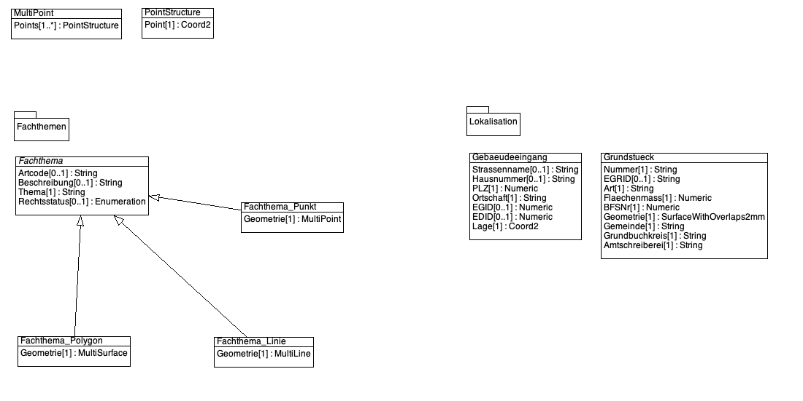

# Dokumentation GIS-Schnittstelle eBauSO

Es handelt sich um eine ergänzende Dokumentation zum [roten Faden](https://github.com/sogis/dok/blob/dok/dok_rote_faeden/Documents/DSBJD/ebauso/ebauso.md). Die Rote-Faden-Dokumentationen sind in einem nicht public Github-Repository.

Dokumente: 
 - Grobkonzept [GIS-Integration vom 29. April 2024](ebauso_gis_integration_V_0_1.docx)

## Struktur Rahmenmodell (Datenmodell)

Es wurde beschlossen, dass für die Schnittstelle zum Bezug von GIS-Informationen ein separates Datenmodell erstellt wird. In diesem Datenmodell resp. in den entsprechenden Tabellen in der Datenbank werden alle von eBauSO benötigten Daten gespeichert und sie werden als Dataservice-Layer publiziert. Damit soll vermieden werden, dass Änderungen im Originalmodell Auswirkungen auf die GIS-Schnitstelle haben und sich eBauSO ständig anpassen muss. Änderungen in den Originalmodellen werden durch den Datenherrn ausgelöst. 

Die Daten werden täglich aus den Originaltabellen aktualisiert. Schlägt eine Aktualisierung fehl, weil z.B. das Originalmodell geändert hat und es nicht mehr direkt kompatibel ist, funktioniert die Schnittstelle immer noch und das AGI kümmert sich um die Anpassung des Datenumbaus/Datentransfers. Dies kann in der Regel innerhalb von wenigen Tagen gemacht werden. Die GIS-Schnittstelle funktioniert immer noch, nur nicht mehr mehr mit top-aktuellen Daten.

Das neue Datenmodell ist ein Rahmenmodell, d.h. alle sogenannten Fachthemen (z.B. Gewässerschutz, Fruchtfolgeflächen, ...) müssen in eine gemeinsame Struktur gepackt werden können. **Die Aussage des Themas muss in unserem Fall mittels zwei Attributen (`Artcode`, `Beschreibung`) erreicht werden können.** Dies entspricht der Struktur des ÖREB-Katasters, aus dem auch einige Themen stammen. Es gibt darüber hinaus ein Geometrieattribut und das Attribut `Thema`, welches beschreibt, um welches Fachthema es sich beim Objekt handelt (z.B. `ch.Grundwasserschutzzonen`, `ch.SO.Fruchtfolgeflaechen`). Die Codierung ist an den ÖREB-Kataster angelehnt.

Zusätzlich gibt es zwei Klassen/Tabellen, die für Lokalisation des Bauvorhabens verwendet werden können: Gebäudeeingänge und Grundstücke.

Datenmodell:

[https://geo.so.ch/models/DSBJD/SO_DSBJD_eBauSO_Rahmenmodell_20240807.ili](https://geo.so.ch/models/DSBJD/SO_DSBJD_eBauSO_Rahmenmodell_20240807.ili)

## Schnittstelle

Es stehen ingesamt fünf Dataservice-Layer zur Verfügung. Der gleiche [Dataservice](https://geo-i.so.ch/api/data/v1/api/) (mit anderen Layern) wird bereits für SOBAU verwendet.

### Grundstücke

Layername: `ch.so.dsbjd.ebauso_lokalisation_grundstueck.data`

Beinhaltet sämtliche rechtsgültigen Grundstücke mit verschiedenen Sachinformationen (Gemeinde, EGRID, BFS-Nummer, ...).

Es wird innerhalb des Kantonsgebietes mindestens ein Objekt (`art=Liegenschaft`) zurückgeliefert. Gibt es an der Stelle auch ein selbstständiges und dauerndes Recht ist dieses auch Bestandteil der Antwort (`art=SelbstRecht.Baurecht` oder `art=SelbstRecht.Quellenrecht`).

Beispiel:

https://geo-i.so.ch/api/data/v1/ch.so.dsbjd.ebauso_lokalisation_grundstueck.data/?&bbox=2610550,1229460,2610550,1229460

### Gebäudeeingang

Layername: `ch.so.dsbjd.ebauso_lokalisation_gebaeudeeingang.data`

Es werden die Gebäudeingänge zurückgeliefert. Der Request muss in der Regel gebuffert erfolgen, damit ein Eingang gefunden wird. Die Buffergrösse muss das Projekt resp. die Fachstellen definieren und kann nicht durch das AGI gemacht werden.

Beispiel:

https://geo-i.so.ch/api/data/v1/ch.so.dsbjd.ebauso_lokalisation_gebaeudeeingang.data/?&bbox=2610530,1229440,2610570,1229480

### Fachthemen

Es gibt pro Geometrietyp einen Dataservice-Layer (Flächen, Linien und Punkt).

Der Artcode beinhaltet eine "Code ähnliche" Information (z.B. `N490_Golfzone`). Die Beschreibung entspricht einer Prosa-Beschreibung der Information (z.B. `Golfplatz Wylihof`). **Es können also maximal zwei Sachinformationen vermittelt werden.** Das Attribut `Thema` entspricht dem Ursprungsfachthema (aus welchem Thema stammen die Daten?). Die Codierung ist an Themen-Codierung im ÖREB-Kataster angelehnt. 

Es ist Sache der Anwendung (eBauSO) zu entscheiden wann und wie der Request zum Dataservice gemacht wird. So kann es unter Umständen sinnvoll sein, mit einem Request möglichst viele Themen anzufordern. Für gewisse Fragestellungen (z.B. "Liegt das Baugesuch innnerhalb einer Fruchtfolgefläche?") ist es eventuell sinnvoller einen Request zu machen, der nur das Thema "Fruchfolgefläche" anfordert. Wenn keine Objekte zurückgeliefert werden, weiss man, dass das Baugesuch nicht innerhalb einer Fruchtfolgefläche liegt. 

#### Beispiel: Drei Themen an einem Punkt

https://geo-i.so.ch/api/data/v1/ch.so.dsbjd.ebauso_fachthemen_flaechen.data/?&bbox=2610550,1229460,2610550,1229460

An diesem Punkt sind drei Themen betroffen: `ch.Grundwasserschutzzonen`, `ch.BelasteteStandorte` und `ch.SO.NutzungsplanungGrundnutzung`

#### Beispiel: Wald- und Gewässernähe

https://geo-i.so.ch/api/data/v1/ch.so.dsbjd.ebauso_fachthemen_flaechen.data/?&bbox=2610460,1227980,2610500,1228020&filter=[[%22thema%22,%22=%22,%22ch.SO.Bodenbedeckung%22]]

Für die Prüfung, ob das Baugesuch in Wald- oder Gewässernähe liegt, wird ein BBOX-Request (mit einer Buffergrösse) und einem Thema-Filter benötigt.

#### Beispiel: Linien- und Punkte

Analog zum Flächenlayer gibt es auch je einen Layer mit Linien- und Punktgeometrien. Dies sind wohl in der Regel immer mit einem BBOX-Filter mit einer Ausdehnung auszuführen.

https://geo-i.so.ch/api/data/v1/ch.so.dsbjd.ebauso_fachthemen_linien.data/?&bbox=2605130,1228960,2605170,1229000

https://geo-i.so.ch/api/data/v1/ch.so.dsbjd.ebauso_fachthemen_punkte.data/?&bbox=2607600,1228600,2607680,1228640

## Dateninhalt

Es sind folgende Themen vorhanden:

| Themencode | DB-Tabelle | Geometrietyp |
| ------------- | ------------ | --------|
| ch.BelasteteStandorte | ÖREB-Kataster | Fläche |
| ch.Grundwasserschutzareale | ÖREB-Kataster | Fläche |
| ch.Grundwasserschutzzonen | ÖREB-Kataster | Fläche |
| ch.SO.Archaeologie | ada_archaeologie_pub_v1.public_flaechenfundstelle_siedlungsgebiet, ada_archaeologie_pub_v1.public_punktfundstelle_siedlungsgebiet | Fläche, Punkt |
| ch.SO.Bodenbedeckung | agi_mopublic_pub.mopublic_bodenbedeckung | Fläche |
| ch.SO.Denkmalschutz | ada_denkmalschutz_pub.denkmal_polygon, ada_denkmalschutz_pub.denkmal_punkt | Fläche, Punkt | 
| ch.SO.Fruchtfolgeflaechen | alw_fruchtfolgeflaechen_pub_v1.fruchtfolgeflaeche | Fläche |
| ch.SO.GefahrengebietSynoptisch | afu_naturgefahren_pub_v1.synoptisches_gefahrengebiet | Fläche | 
| ch.SO.NutzungsplanungErschliessung | arp_nutzungsplanung_pub_v1.nutzungsplanung_erschliessung_linienobjekt, arp_nutzungsplanung_pub_v1.nutzungsplanung_erschliessung_punktobjekt, arp_nutzungsplanung_pub_v1.nutzungsplanung_erschliessung_flaechenobjekt | Fläche, Linie, Punkt |
| ch.SO.NutzungsplanungGrundnutzung | arp_nutzungsplanung_pub_v1.nutzungsplanung_grundnutzung | Fläche |
| ch.SO.NutzungsplanungUeberlagernd | arp_nutzungsplanung_pub_v1.nutzungsplanung_ueberlagernd_flaeche, arp_nutzungsplanung_pub_v1.nutzungsplanung_ueberlagernd_linie, arp_nutzungsplanung_pub_v1.nutzungsplanung_ueberlagernd_punkt | Fläche, Linie, Punkt |
| ch.SO.RichtplanJuraschutzzone | arp_richtplan_pub_v2.richtplankarte_ueberlagernde_flaeche | Fläche |

Im Thema `ch.SO.Bodenbedeckung` ist nur Wald und Gewässer vorhanden. Für die Juraschutzzone werden nur Objekte `objekttyp = 'Juraschutzzone'` verwendet.

Für die Daten, die aus dem ÖREB-Kataster verwendet werden, weist das Attribut `Rechtsstatus` einen Wert aus (`inKraft`, `AenderungOhneVorwirkung`, `AenderungMitVorwirkung`). Darauf ist bei der Weiterverarbeitung / beim Entscheidungsprozess in eBauSO zwingend Rücksicht zu nehmen. Falls gewünscht, kann auf das Attribut verzichtet werden. In diesem Fall filtern wir alle Objekte ungleich `inKraft` bereits in der Datenbank.

